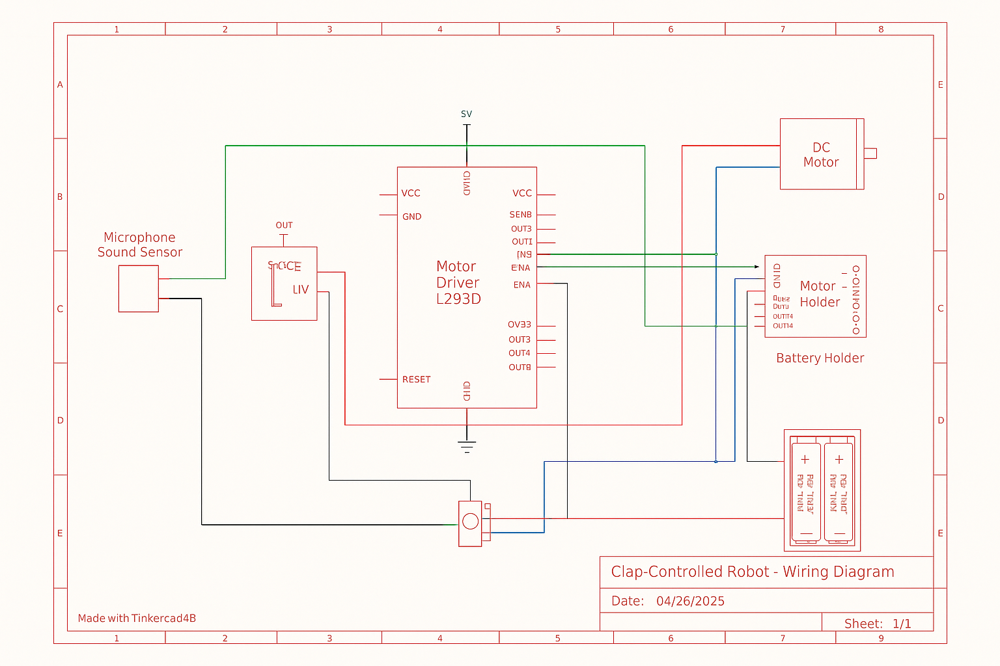

<h2>Robot contrôlé par claquement de mains avec Arduino Uno </h2>

|                     |                     |
|---------------------|---------------------|
| Auteur              | [Diana Maria Rotaru](https://github.com/dianarotaru086) |

## Description

Ces dernières années, la technologie robotique a considérablement évolué, offrant des solutions innovantes pour un large éventail de domaines, de l’éducation et de la sécurité à l’automatisation industrielle. Un exemple d'une telle solution est le robot contrôlé par des applaudissements, qui utilise Arduino Uno et un module de capteur sonore pour interagir avec l'utilisateur.

Ce projet consiste en un robot mobile capable de détecter les claquements de mains et d’y répondre en effectuant différentes actions (avancer, reculer, tourner à gauche/droite, s’arrêter). Basé sur une carte Arduino Uno, il utilise un capteur sonore KY-038 pour reconnaître les applaudissements et un module L293D pour contrôler les moteurs.

## Motivation

L’un des principaux avantages de ce projet est sa polyvalence. Bien que reposant sur une conception électronique minimaliste, la plateforme offre des possibilités d’extension quasi illimitées pour des applications avancées dans divers domaines technologiques.

Systèmes de contrôle gestuel pour les utilisateurs handicapés: L’un des domaines les plus importants dans lesquels ce projet pourrait apporter des avantages significatifs est l’accessibilité. Les personnes à mobilité réduite pourraient utiliser les applaudissements pour contrôler des robots ou d’autres appareils électroniques. Cela permettrait de rendre la technologie plus accessible à un large public.

Robots éducatifs pour l'apprentissage de la robotique: Le projet peut devenir une excellente base pour un robot éducatif, aidant les étudiants à apprendre les concepts fondamentaux de la robotique et de l’électronique. Idéal pour les ateliers STEM (Science, Technology, Engineering, Mathematics) et excellent outil pour apprendre la programmation Arduino, la détection sonore et le contrôle des moteurs.

Automatisation industrielle et collaborative: Dans le milieu industriel, cette pointe de robot peut être utilisée pour ajuster l'automatisation d'un ou de sarcins répétitifs. Par exemple, un robot peut transporter des objets dans un dépôt, et un autre peut contrôler plusieurs robots à partir de la main, en coordonnant le travail pour divers sarcins.

## Architecture

Le système de robot contrôlé par clap comprend plusieurs composants qui fonctionnent ensemble pour détecter les sons de clap et contrôler le mouvement du robot. L'architecture du système peut être divisée en trois parties principales : la détection, le traitement et l'actionnement. 

Le composant de détection se compose d'un module de microphone avec un capteur sonore KY-038, qui est chargé de détecter les applaudissements ou autres sons courts dans l'environnement. Ce module convertit les variations de pression sonore en signaux électriques interprétables par le microcontrôleur.

Le composant de traitement est réalisé par une carte Arduino Uno R3. Celui-ci reçoit le signal du capteur sonore et l'interprète pour déterminer si un applaudissement a été détecté. En fonction du nombre et de la séquence de battements détectés, Arduino envoie des commandes aux modules de contrôle du moteur pour effectuer des actions telles que : avancer, reculer, tourner à gauche ou à droite.

Le composant d'entraînement se compose d'un pilote de moteur L293D et de deux moteurs de roue. Le pilote L293D permet le contrôle bidirectionnel des moteurs à courant continu, permettant au robot d'avancer, de tourner ou de s'arrêter en fonction des commandes. Le système est alimenté par un support de batterie 18650, offrant portabilité et autonomie.

## Schéma fonctionnel / Block Diagram

## Schéma des composants du robot

## Schéma électrique

## Composants

| Appareil                                                  | Usage                                        | Prix unitaire (RON)  |  Prix total (RON)  |
|-----------------------------------------------------------|----------------------------------------------|----------------------|--------------------|
| Arduino Uno R3 (ATmega328p + ATmega16u2) + cable USB      | Microcontrôleur                              | [54.37](https://www.optimusdigital.ro/ro/placi-avr/4561-placa-de-dezvoltare-compatibila-cu-arduino-uno-r3-atmega328p-atmega16u2-cablu-50-cm.html)  | 54.37              |
| L293D Module de commande de moteur                        | Pilote de moteur pour contrôler les moteurs  | [15.46](https://www.optimusdigital.ro/en/pwmservo-controllers/987-l293d-motor-control-shield-motor-drive-expansion-board.html)                | 15.46              |
| DC 12V Moteurs à engrenages avec roues                    | Moteurs pour le mouvement des robots         | [14.99](https://www.optimusdigital.ro/en/others/139-gearmotor-with-wheel.html)            | 59.96              |
| KY-038 Module de capteur sonore                           | Capteur de détection sonore                  | [5.95](https://sigmanortec.ro/Modul-microfon-senzor-sunet-p126025149)                 | 5.95               |
| 18650 Support de batterie avec interrupteur               | Support de batterie pour alimentation        | [7.14](https://sigmanortec.ro/Suport-baterie-18650-2S-cu-capac-si-intrerupator-p192040353)                | 7.14               |
| Fils de liaison (mâle-femelle)                            | Composants de connexion                      | [7.94](https://sigmanortec.ro/40-Fire-Dupont-30cm-Tata-Mama-p210854349)                 | 7.94               |
| 18650 Batterie                                            | Alimentation électrique pour moteu           | [19.90](https://altex.ro/acumulator-ideallstore-gh-18650-6800-mah-3-7-v-li-ion-rosu/cpd/66F29733DE86D/)                | 39.80              |
|                                                           |                                              |                      | Total: 192.45      |

### Libraries

| Library | Description | Usage |
|---------|-------------|-------|
|  |  | |
| |  |  |

## Log

### Semaine 9 - 21 Avril
J'ai acheté les composants du robot sur les sites Web: [Sigmanortec](https://sigmanortec.ro/) et [Optimus Digital](https://www.optimusdigital.ro/)

### Week 7 - 19 May

### Week 20 - 26 May

## Référence
[Tutorial](https://www.youtube.com/watch?v=EZhxfLhEE3o)

